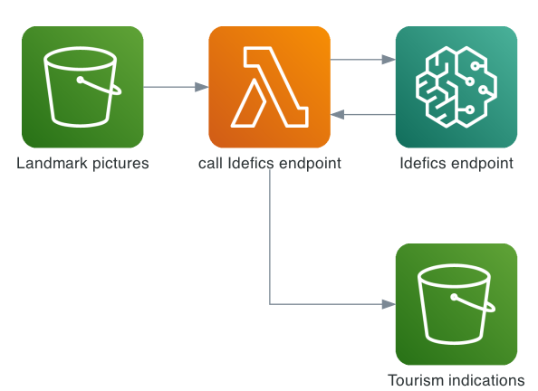
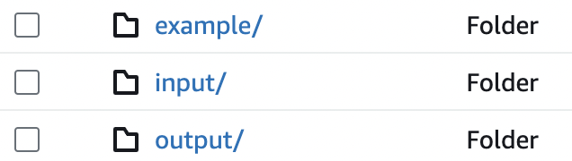
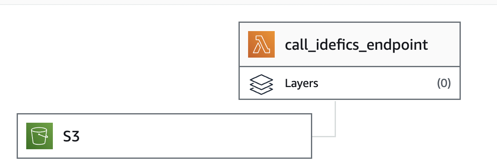
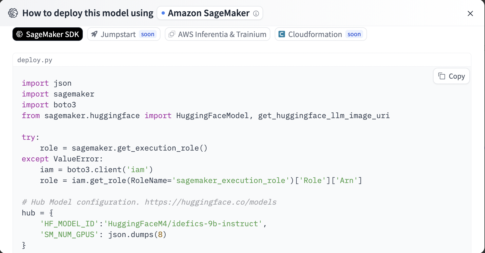

# Visual Tourism : ML Application Design on AWS with 

This repository contains the design and implementation details of a machine learning application on AWS that uses a  model. 

The application is called **Visual Tourism**, and aims to be an LLM travel agent for a user that seeks advices when visiting a new place. The user take a picture of a landmark, and upload it on AWS to run an inference and get informations or advices about where to eat. The application presented in both this Readme and the notebook was designed to be a simple demo.

## Infrastructure

The infrastructure of this application is built on AWS and involves several services such as S3, Lambda, and SageMaker. 

- Amazon S3 is an object storage service that is designed for 99.999999999% of durability, scalable. 
- Lambda is a serverless service which run code, it can scale depending on the input traffic.
- Sagemaker is an ML service to build, train and deploy models.

The overall workflow is simple :

  

A user starts the automated workflow by uploading a picture of a landmark in S3, and this putEvent triggers a lambda function whose task is to call an endpoint to infer details about the place where the user is. The endpoint hosts a visual language model that takes as input an image and a prompt, to return an answer. 

I purposely fixed a prompt that would suit well for the task, with an example for an in-context learning. Therefore the user just need to upload a picture and retrieves the answer from the language model in the same S3 bucket but a different folder.

### S3 Bucket

The S3 folders are organized as follow : 

  

- `input/` is the folder that hosts user images, and triggers the lambda function at every PUT
- `example/` is used to host an example image for the in-context learning prompt
- `output/` is the folder used by the lambda function to return the answer from the model
  

### Lambda Function

The Lambda function is triggered by the PUT event of uploading an image to the S3 bucket. You can find more info on the S3 event notifications [here](https://docs.aws.amazon.com/AmazonS3/latest/userguide/notification-how-to-event-types-and-destinations.html). 

  

Once triggered, it calls a SageMaker endpoint to make a prediction. But before that it prepares the prompt to be sent. 
The whole code is not explain here in the Readme, but you can check the `lambda_code.py` file for more info.

### The HF model used : Idefics

 

[Idefics](https://huggingface.co/blog/idefics) is a VLM (Vision-Language Model) well suited for our task. It is built on top of two pre-trained models, the vision model [CLIP-ViT](https://huggingface.co/laion/CLIP-ViT-H-14-laion2B-s32B-b79K) and the language model [LLama-65b](https://huggingface.co/huggyllama/llama-65b). Among other VLMs, we can mention [Flamingo](https://arxiv.org/pdf/2204.14198.pdf),
[LLaVa](https://llava-vl.github.io/) and [Qwen-VL](https://github.com/QwenLM/Qwen-VL). 

The model used is the [9 billions parameters instruct version](https://huggingface.co/HuggingFaceM4/idefics-9b-instruct), allowing us to test our application with a relatively small model, compare to the 80 billions parameters. 

Idefics 9b is among the best open source models in the [open VLM leaderboard](https://huggingface.co/spaces/opencompass/open_vlm_leaderboard). Besides, the model was released by the   team, it is open source, and it is well documented on HF.

### The prompt

The prompt depends on the language model and the [model card](https://huggingface.co/HuggingFaceM4/idefics-9b-instruct#how-to-get-started-with-the-model) often gives us instructions on how to format the it.

In particular, Idefics needs `User: `  and `Assistant: ` to delimitate start of prompt, and answer. But it also needs the `<end_of_utterance>` tag to indicate the end of the user prompt as well as the end of answer from the assistant. Note that the image should be passed as a URL as mentionned in [this excellent blog post on how to deploy Idefics on Sagemaker](https://www.philschmid.de/sagemaker-idefics).

In the application we use in-context learning, meaning that we augment the prompt with an example of question/answer.
The user request is :  

  > You are a travel agent. Describe in 1 sentence what is in the image. Add another sentence for an entertaining story related to this location. Add a last sentence saying what is the best place to eat near this location.

We give an example image of the Trevi fountain in Italy and an example answer : 

  > The Trevi Fountain is a popular tourist attraction in Rome, Italy. The act of tossing a coin with one's right hand over the left shoulder is said to ensure a return to Rome, a promise of enduring romance with the city. The best place to eat near this location is the Pinsitaly Trevi restaurant.

### SageMaker Endpoint

The real-time endpoint hosts the Hugging Face model. It receives the image from the Lambda function and uses the model to make a prediction in real-time.

**Deploying the model**

To easily deploy the model in sagemaker, we can follow the model card on   : 

, 

We can follow this code, and modify some values. In particular we don't use the recommended `ml.p4d.24xlarge`instance that has 8 GPUs, but instead we deploy the model on a 4 GPUs `ml.g4dn.12xlarge` which is sufficient for the demo. It is also about [7 times cheaper](https://aws.amazon.com/fr/sagemaker/pricing/). 

**Autoscaling**

To ensure our endpoint scales out with increased requests, we can enable autoscaling with a target tracking policy, choosing the right metric to track. 

We can load test the application and monitor the metrics on CloudWatch to identify the best metric that matches our needs. [This very detailled AWS documentation](https://aws.amazon.com/blogs/machine-learning/best-practices-for-load-testing-amazon-sagemaker-real-time-inference-endpoints/) explains good practices using **Locus**. It is out of scope for this demo, therefore we chose the InvocationsPerInstance metric to illustrate.

Note that even though we can choose the maximum number of instances the scaling policy can create, there is a quota limit that can be rapidly reached.

## Usage

To use this application, the model should be deployed first by creating a real time inference endpoint, waiting for inputs. 

Once the endpoint is running, with the autoscaling on, we can upload an image to the specified S3 bucket. The system will automatically process the image and return a prediction. There is a demo test using boto3 in the notebook. The S3 bucket is public, so anyone can trigger the workflow, however for cost reasons the model is not currently deployed. 

You can go step by step and recreate the infrastructure, with the code provided. 

## Example 

### Eiffel Tower 

  

Output from the LLM : 

> The Eiffel Tower is a famous landmark in Paris, France. It is a symbol of the city and a popular tourist attraction. The best place to eat near this location is the Michelin-starred Le Jules Verne restaurant.

### Neuschwanstein castle

  

Output from the LLM : 

> The Neuschwanstein Castle is a beautiful castle in Bavaria, Germany. It is a popular tourist attraction and is often associated with the fairy tale castle in Disney's Sleeping Beauty. The best place to eat near this location is the Schlossrestaurant Hohenschwangau.

## Improvements

### Choosing another model

The current model is not the best performing model on the VLM leaderboard. More importantly, We should pay attention to the License attached to it. The License of Idefics is dependent on the two models it was built upon, namely CLIP-ViT and Llama-65b, and is therefore limited to research purposes, more info [here](https://huggingface.co/HuggingFaceM4/idefics-9b-instruct#license).

### Allowing the user to change the LLM parameters

The LLM parameters for the inference such as the **temperature**, the **top k**, **top p**, **max tokens** are fixed in the lambda function. 

However we could allow the user to tweak the parameters in order to refine the inference. One way could be to save those into a relational database using [RDS](https://aws.amazon.com/rds/) or a NoSQL database using [DynamoDB](https://aws.amazon.com/dynamodb). Both solutions can be set to highly available and fault tolerant services. A second lambda would modify the inference parameters and the `call_idefics` lambda would query them from the database depending on the user. 

### Adding an API gateway

The current application suppose that the user directly has access to an S3 bucket, but it would be better to provde an API that connects a frontend and our application. [API Gateway](https://aws.amazon.com/api-gateway/) is an AWS service that can be easily linked to a lambda function and a sagemaker endpoint.

### Improving the prompt example

The current prompt example is a rather simple one-shot in context learning. We could add more examples for a better output, we could also ask for more informations or recommendations, such as the nearest cheapest hotel, the typical activities around and more.

### Addind a CloudFormation template 

For reproducibility, versionning of infrastructure, fast deployment we could create a CoudFormation template to deploy our infrastructure all at once.